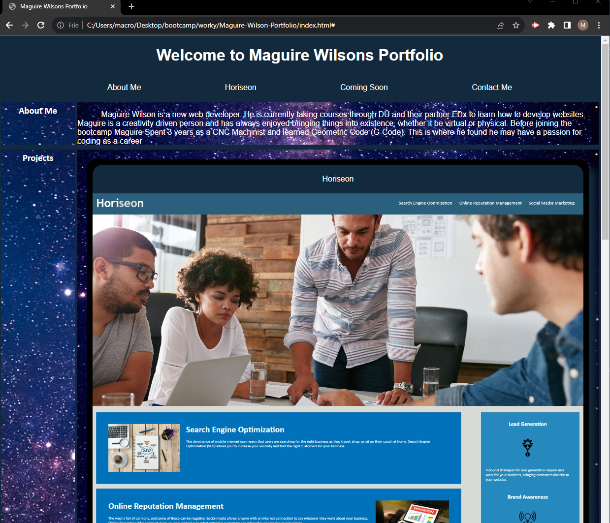

# <Maguire Wilson Portfolio>

## Description

Portfolio website for Maguire Wilsons projects

## Table of Contents

- [Installation](#installation)
- [Usage](#usage)
- [Credits](#credits)
- [Features](#features)
- [screenshot](#screenshot)

## Installation

Using Git bash create a repository and use that to store update information with issues, and logged pull requests. Editing code through Visual Studio Code

## Usage

Browse the Creations of Maguire Wilson

## Credits

Maguire Wilson. Steam community user M 4! for coming soon GIF. Thanks to Luke Douglas on Stackoverflow for example code on how to shade an image when hovered.

## Features

Functional links [LINK TO ONLINE SITE] (https://macrowil.github.io/Maguire-Wilson-Portfolio/)

## Screenshot

